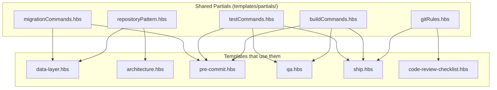

# `backend-ai-starter-recipes` — Visual Architecture

How the CLI generates every AI instruction file, end to end.

---

## 1. High-Level Pipeline

```mermaid
flowchart LR
    A["npx backend-ai-starter-recipes"] --> B["Interactive Prompts<br/>(@inquirer/prompts)"]
    B --> C["TemplateContext<br/>object"]
    C --> D["Handlebars<br/>Engine"]
    D --> E[".ai/ directory<br/>(canonical)"]
    E --> F["IDE Adapters"]
    F --> G[".cursor/ .claude/<br/>CLAUDE.md etc."]

    style A fill:#1a1a2e,stroke:#e94560,color:#fff
    style B fill:#16213e,stroke:#0f3460,color:#fff
    style C fill:#0f3460,stroke:#533483,color:#fff
    style D fill:#533483,stroke:#e94560,color:#fff
    style E fill:#e94560,stroke:#fff,color:#fff
    style F fill:#16213e,stroke:#0f3460,color:#fff
    style G fill:#1a1a2e,stroke:#e94560,color:#fff
```



---

## 2. Prompt → Context → Template Flow (Detailed)

```mermaid
flowchart TB
    subgraph PROMPTS["User Answers"]
        P1["framework: nestjs"]
        P2["orm: prisma"]
        P3["validation: class-validator"]
        P4["auth: jwt-passport"]
        P5["testFramework: jest"]
        P6["ideTargets: cursor, claude-code"]
        P7["skills: plan-review, code-review, qa, ship"]
    end

    subgraph CONTEXT["TemplateContext (derived)"]
        C1["ormServiceName: PrismaService"]
        C2["ormSchemaPath: prisma/schema.prisma"]
        C3["testCommand: npm run test"]
        C4["isNestJS: true"]
        C5["hasPrisma: true"]
        C6["hasSwagger: true"]
    end

    subgraph TEMPLATES["18 Handlebars Templates"]
        T1["agent.hbs"]
        T2["rules/architecture.hbs"]
        T3["rules/data-layer.hbs"]
        T4["rules/api-patterns.hbs"]
        T5["rules/errors-logging-security.hbs"]
        T6["rules/external-integrations.hbs"]
        T7["rules/testing.hbs"]
        T8["rules/pre-commit.hbs"]
        T9["skills/plan-review.hbs"]
        T10["skills/code-review-*.hbs"]
        T11["skills/qa.hbs"]
        T12["skills/ship.hbs"]
        T13["context/domain-map.hbs"]
        T14["context/tech-stack.hbs"]
        T15["tracking/efficiency.hbs"]
    end

    subgraph OUTPUT[".ai/ Output"]
        O1["AGENT.md"]
        O2["rules/architecture.md"]
        O3["rules/data-layer.md"]
        O4["rules/api-patterns.md"]
        O5["rules/errors-logging-security.md"]
        O6["rules/external-integrations.md"]
        O7["rules/testing.md"]
        O8["rules/pre-commit.md"]
        O9["skills/plan-review/SKILL.md"]
        O10["skills/code-review/SKILL.md + checklist.md"]
        O11["skills/qa/SKILL.md"]
        O12["skills/ship/SKILL.md"]
        O13["context/domain-map.md"]
        O14["context/tech-stack.md"]
        O15["tracking/efficiency.md"]
    end

    PROMPTS --> CONTEXT
    CONTEXT --> TEMPLATES
    TEMPLATES --> OUTPUT
```



---

## 3. Template Rendering — How One File Gets Built

Take `data-layer.hbs` as an example. Here's what happens for **each ORM choice**:

### Input: `data-layer.hbs` (simplified)

```handlebars
# Data Layer{{#if (neq orm "none")}} ({{orm}}){{/if}}

{{#if (eq orm "none")}}
> No ORM selected. Add your data access patterns here.
{{else}}

## Repository Pattern

All database access goes through `[feature].repository.ts`.
Services **never** import `{{ormServiceName}}` directly.

## Schema & Models

{{#if (eq orm "prisma")}}
- Schema: `prisma/schema.prisma`
- Use UUIDs for primary keys
- Use `BigInt` for financial/crypto amounts
- Enforce unique constraints at schema level
{{else if (eq orm "typeorm")}}
- Entities: `src/entities/*.entity.ts`
- Use `@PrimaryGeneratedColumn('uuid')` for primary keys
- Use `decimal` type for financial amounts
- Use `@Unique()` decorator for uniqueness constraints
{{else if (eq orm "drizzle")}}
- Schema: `src/db/schema.ts`
- Use `uuid().defaultRandom()` for primary keys
- Use `numeric` for financial amounts
{{else if (eq orm "mikro-orm")}}
- Entities: `src/entities/*.entity.ts`
- Use `@PrimaryKey({ type: 'uuid' })` with `v4()` default
{{else if (eq orm "knex")}}
- Migrations: `src/db/migrations/`
- Seeds: `src/db/seeds/`
{{/if}}

## Migration Commands

{{> migrationCommands }}

{{/if}}
```

### Output for each ORM:

````carousel
```markdown
# Data Layer (prisma)

## Repository Pattern
All database access goes through `[feature].repository.ts`.
Services **never** import `PrismaService` directly.

## Schema & Models
- Schema: `prisma/schema.prisma`
- Use UUIDs for primary keys
- Use `BigInt` for financial/crypto amounts

## Migration Commands
- Create: `npx prisma migrate dev --name <name>`
- Apply: `npx prisma migrate deploy`
- Generate client: `npx prisma generate`
```
<!-- slide -->
```markdown
# Data Layer (typeorm)

## Repository Pattern
All database access goes through `[feature].repository.ts`.
Services **never** import `DataSource` directly.

## Schema & Models
- Entities: `src/entities/*.entity.ts`
- Use `@PrimaryGeneratedColumn('uuid')` for primary keys
- Use `decimal` type for financial amounts

## Migration Commands
- Generate: `npx typeorm migration:generate -n <name>`
- Run: `npx typeorm migration:run`
- Revert: `npx typeorm migration:revert`
```
<!-- slide -->
```markdown
# Data Layer (drizzle)

## Repository Pattern
All database access goes through `[feature].repository.ts`.
Services **never** import `db` directly.

## Schema & Models
- Schema: `src/db/schema.ts`
- Use `uuid().defaultRandom()` for primary keys
- Use `numeric` for financial amounts

## Migration Commands
- Generate: `npx drizzle-kit generate`
- Push (dev): `npx drizzle-kit push`
- Migrate (prod): `npx drizzle-kit migrate`
```
````

---

## 4. IDE Adapter Pipeline

The adapters read generated `.ai/` files and **transform** them into IDE-native formats:

```mermaid
flowchart TB
    AI[".ai/AGENT.md<br/>.ai/rules/*.md<br/>.ai/skills/*/SKILL.md"]

    subgraph CURSOR["Cursor Adapter"]
        direction TB
        CA1["Read .ai/rules/*.md"]
        CA2["Add .mdc frontmatter<br/>(alwaysApply, globs)"]
        CA3["Rename .md → .mdc"]
        CA4["Write to .cursor/rules/"]
    end

    subgraph CLAUDE["Claude Code Adapter"]
        direction TB
        CC1["Read .ai/AGENT.md"]
        CC2["Concat all rules into<br/>single CLAUDE.md"]
        CC3["Copy skills to<br/>.claude/skills/"]
        CC4["Write CLAUDE.md<br/>to project root"]
    end

    subgraph VSCODE["VS Code Copilot Adapter"]
        direction TB
        CV1["Read .ai/AGENT.md + all rules"]
        CV2["Merge into single file"]
        CV3["Write to<br/>.github/copilot-instructions.md"]
    end

    subgraph ANTIGRAVITY["Antigravity Adapter"]
        direction TB
        AG1["Read .ai/skills/*/SKILL.md"]
        AG2["Add workflow frontmatter<br/>(description)"]
        AG3["Write to<br/>.agents/workflows/"]
    end

    subgraph WINDSURF["Windsurf Adapter"]
        direction TB
        WS1["Read .ai/AGENT.md + all rules"]
        WS2["Merge into single file"]
        WS3["Write to<br/>.windsurfrules"]
    end

    AI --> CURSOR
    AI --> CLAUDE
    AI --> VSCODE
    AI --> ANTIGRAVITY
    AI --> WINDSURF
```



### What each adapter transforms:

| Source (`.ai/`) | Cursor | Claude Code | VS Code | Antigravity | Windsurf |
|-----------------|--------|-------------|---------|-------------|----------|
| `AGENT.md` | → `rules/index.mdc` | → `CLAUDE.md` (top section) | → `.github/copilot-instructions.md` (merged) | _(not used)_ | → `.windsurfrules` (merged) |
| `rules/*.md` | → `rules/*.mdc` + frontmatter | → `CLAUDE.md` (appended sections) | → merged into single file | _(not used)_ | → merged into single file |
| `skills/*/SKILL.md` | → `skills/*/SKILL.md` (as-is) | → `.claude/skills/*/SKILL.md` | _(not supported)_ | → `.agents/workflows/*.md` | _(not supported)_ |
| `context/*.md` | → `context/*.md` (as-is) | → referenced in `CLAUDE.md` | _(not supported)_ | _(not used)_ | _(not supported)_ |

---

## 5. Concrete Output Examples

### Example A: NestJS + Prisma + Jest → Cursor + Claude Code

```
my-nestjs-app/
├── .ai/                                    # ← CANONICAL (always)
│   ├── AGENT.md                            #    "NestJS + TypeScript backend..."
│   │                                       #    Repository pattern with PrismaService
│   │                                       #    class-validator DTOs, Swagger
│   ├── rules/
│   │   ├── architecture.md                 #    NestJS module structure, DI, guards
│   │   ├── data-layer.md                   #    Prisma schema, migrations, BigInt
│   │   ├── api-patterns.md                 #    @ApiProperty, ValidationPipe, versioning
│   │   ├── errors-logging-security.md      #    NestJS exceptions, Sentry, no PII
│   │   ├── external-integrations.md        #    src/external/ pattern, try/catch
│   │   ├── testing.md                      #    Jest, TestBed, describe/it
│   │   └── pre-commit.md                   #    npm run build/lint/test gates
│   ├── skills/
│   │   ├── plan-review/SKILL.md
│   │   ├── code-review/
│   │   │   ├── SKILL.md
│   │   │   └── checklist.md                #    Prisma-specific checks included
│   │   ├── qa/SKILL.md                     #    npm run build/lint/test commands
│   │   └── ship/SKILL.md                   #    git flow + npm scripts
│   ├── context/
│   │   ├── domain-map.md                   #    NestJS architecture skeleton, user fills
│   │   └── tech-stack.md                   #    Pre-filled: NestJS, Prisma, PostgreSQL...
│   └── tracking/
│       └── efficiency.md
│
├── .cursor/                                # ← CURSOR ADAPTER
│   └── rules/
│       ├── index.mdc                       #    alwaysApply: true
│       ├── architecture.mdc                #    alwaysApply: true
│       ├── data-layer.mdc                  #    globs: prisma/**/*,**/*.repository.ts
│       ├── api-patterns.mdc                #    globs: **/*.dto.ts,**/*.controller.ts
│       ├── errors-logging-security.mdc     #    alwaysApply: true
│       ├── external-integrations.mdc       #    globs: src/external/**/*.ts
│       ├── testing.mdc                     #    globs: **/*.spec.ts,**/*.e2e-spec.ts
│       └── pre-commit.mdc                  #    alwaysApply: true
│
├── CLAUDE.md                               # ← CLAUDE CODE ADAPTER
│   # Project: my-nestjs-app
│   # NestJS + Prisma + PostgreSQL + Jest
│   # [all rules merged into sections]
│   # Skills: .claude/skills/
│
└── .claude/
    └── skills/
        ├── plan-review/SKILL.md
        ├── code-review/
        │   ├── SKILL.md
        │   └── checklist.md
        ├── qa/SKILL.md
        └── ship/SKILL.md
```

### Example B: Express + TypeORM + Vitest → VS Code Copilot only

```
my-express-app/
├── .ai/                                    # ← CANONICAL
│   ├── AGENT.md                            #    "Express + TypeScript backend..."
│   │                                       #    Repository pattern with DataSource
│   │                                       #    zod validation, no Swagger
│   ├── rules/
│   │   ├── architecture.md                 #    Express middleware, router structure
│   │   ├── data-layer.md                   #    TypeORM entities, migrations, decorators
│   │   ├── api-patterns.md                 #    zod schemas, error middleware
│   │   ├── errors-logging-security.md      #    Express error middleware, winston
│   │   ├── external-integrations.md        #    Service wrapper pattern
│   │   ├── testing.md                      #    Vitest, describe/it/expect
│   │   └── pre-commit.md                   #    npx vitest run, tsc --noEmit
│   ├── skills/...
│   ├── context/
│   │   ├── domain-map.md                   #    Express-style architecture skeleton
│   │   └── tech-stack.md                   #    Pre-filled: Express, TypeORM, MySQL...
│   └── tracking/...
│
└── .github/
    └── copilot-instructions.md             # ← VSCODE ADAPTER (single merged file)
```

---

## 6. Framework Variants — What Changes Per Framework

Each template has framework-conditional sections. Here's a map of **what changes**:

| Template | NestJS | Express | Fastify | Hono |
|----------|--------|---------|---------|------|
| **architecture** | Modules, DI, Guards, Interceptors, Pipes | Routers, Middleware stack, app.use() | Plugins, Hooks, Decorators | Middleware, c.json(), Hono groups |
| **data-layer** | Repository in `*.repository.ts`, PrismaModule | Repository pattern, manual DI | Repository pattern, plugin-based | Repository pattern, manual DI |
| **api-patterns** | DTOs + class-validator + @ApiProperty | zod/joi schemas, express-validator | JSON Schema validation, @fastify/swagger | zod + Hono validators |
| **errors** | NestJS exceptions, ExceptionFilter | Express error middleware `(err, req, res, next)` | Fastify error handler, setErrorHandler | Hono onError handler |
| **external-integrations** | Module + Service, DI | Service class, manual instantiation | Plugin + Service | Service class, manual |
| **testing** | TestBed, @nestjs/testing | supertest + test framework | fastify.inject() + test framework | Hono test client |
| **pre-commit** | `npm run build` (Nest CLI) | `tsc --noEmit` | `tsc --noEmit` | `tsc --noEmit` |

---

## 7. Template Partial System

Shared blocks used across multiple templates (Handlebars **partials**):



This avoids duplication — e.g., migration commands are defined **once** in `migrationCommands.hbs` and reused in `data-layer.hbs`, `pre-commit.hbs`, and `ship.hbs`.

---

## 8. Complete File Manifest with Conditional Logic

| # | Template | Generates | Condition | Uses Partials |
|---|----------|-----------|-----------|---------------|
| 1 | `agent.hbs` | `.ai/AGENT.md` | Always | — |
| 2 | `rules/architecture.hbs` | `.ai/rules/architecture.md` | Always | `repositoryPattern` |
| 3 | `rules/data-layer.hbs` | `.ai/rules/data-layer.md` | `orm ≠ none` | `migrationCommands`, `repositoryPattern` |
| 4 | `rules/api-patterns.hbs` | `.ai/rules/api-patterns.md` | Always | — |
| 5 | `rules/errors-logging-security.hbs` | `.ai/rules/errors-logging-security.md` | Always | — |
| 6 | `rules/external-integrations.hbs` | `.ai/rules/external-integrations.md` | Always | — |
| 7 | `rules/testing.hbs` | `.ai/rules/testing.md` | Always | `testCommands` |
| 8 | `rules/pre-commit.hbs` | `.ai/rules/pre-commit.md` | Always | `testCommands`, `buildCommands`, `migrationCommands` |
| 9 | `skills/plan-review.hbs` | `.ai/skills/plan-review/SKILL.md` | `skills ∋ plan-review` | — |
| 10 | `skills/code-review-skill.hbs` | `.ai/skills/code-review/SKILL.md` | `skills ∋ code-review` | — |
| 11 | `skills/code-review-checklist.hbs` | `.ai/skills/code-review/checklist.md` | `skills ∋ code-review` | `gitRules` |
| 12 | `skills/qa.hbs` | `.ai/skills/qa/SKILL.md` | `skills ∋ qa` | `testCommands`, `buildCommands` |
| 13 | `skills/ship.hbs` | `.ai/skills/ship/SKILL.md` | `skills ∋ ship` | `testCommands`, `buildCommands`, `gitRules` |
| 14 | `skills/document-release.hbs` | `.ai/skills/document-release/SKILL.md` | `skills ∋ document-release` | `gitRules` |
| 15 | `skills/retro.hbs` | `.ai/skills/retro/SKILL.md` | `skills ∋ retro` | — |
| 16 | `context/domain-map.hbs` | `.ai/context/domain-map.md` | Always | — |
| 17 | `context/tech-stack.hbs` | `.ai/context/tech-stack.md` | Always | — |
| 18 | `tracking/efficiency.hbs` | `.ai/tracking/efficiency.md` | Always | — |
| — | **5 partials** | _(embedded in above)_ | — | — |
| — | **5 IDE adapters** | `.cursor/`, `CLAUDE.md`, etc. | Per IDE selection | — |

**Total: 18 templates + 5 partials + 5 adapter modules = 28 source files → up to 18 output files + IDE copies**
