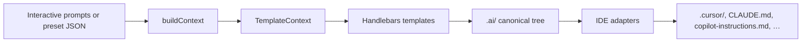
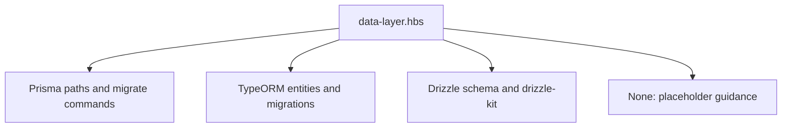

# How it works

The CLI is a **templated pipeline**: your answers become a `TemplateContext`, Handlebars renders Markdown into `.ai/`, then **IDE adapters** copy or merge that into each tool’s native format.

## End-to-end pipeline

1. **Prompts or preset** — Same data shape: framework, ORM, DB, validation, auth, tests, CI, IDEs, skills.  
2. **`buildContext`** — Derives flags and strings the templates need (`hasPrisma`, `ormServiceName`, `testCommand`, …).  
3. **Handlebars** — Rules, skills, `AGENT.md`, context, and tracking Markdown are rendered from `.hbs` files.  
4. **`.ai/`** — The **canonical** copy; treat it as source of truth when in doubt.  
5. **Adapters** — Transform `.ai/` into Cursor `.mdc` rules, merged `CLAUDE.md`, Copilot instructions, etc.

::: details Deeper dive (for contributors)
Templates live under `templates/` in the repo (`agent.hbs`, `rules/`, `skills/`, `partials/`). The engine registers helpers (`eq`, `neq`, `includes`, `or`, `and`) and partials like `migrationCommands` and `gitRules` so ORM- and framework-specific text stays DRY.
:::

## One template, many stacks

`data-layer.hbs` is a good mental model: the **same** template branches on `orm` to emit Prisma vs TypeORM vs Drizzle commands and paths.

That is how the whole generator stays maintainable — **one** rule file per concern, filled with your choices.

---

**Next:** get the CLI on your machine — [Installation](/guide/3-installation).
