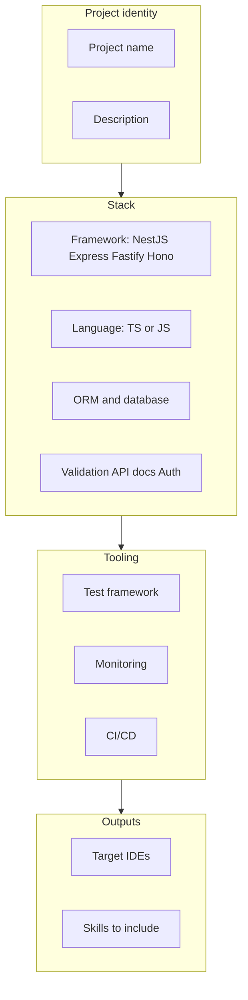

# Usage

## Demo


<div style="margin: 1.5rem 0;">
  <iframe
    width="100%"
    style="aspect-ratio: 16/9; border: none; border-radius: 8px;"
    src="https://www.youtube.com/embed/eZFqKtgjQs0"
    title="BARE demo"
    allow="accelerometer; autoplay; clipboard-write; encrypted-media; gyroscope; picture-in-picture"
    allowfullscreen>
  </iframe>
</div>

## Try it in 2 minutes

Run the NestJS/Prisma preset into a throwaway folder:

```bash
npx backend-ai-starter-recipes --preset nestjs-prisma --output ./my-backend
```

Then inspect the IDE adapter files generated by the preset:

```text
my-backend/
├── .cursor/
│   ├── rules/
│   │   ├── index.mdc                  # agent identity + quality gates
│   │   ├── architecture-api.mdc
│   │   ├── data-layer-migrations.mdc
│   │   └── … (9 rule files)
│   └── skills/
│       ├── think/
│       ├── plan/
│       └── … (7 lifecycle stages)
└── CLAUDE.md                          # if Claude Code was also selected
```

::: tip What gets generated depends on your IDE selection
Each adapter writes only its own native files. Select multiple IDEs and all their formats appear side by side.
:::

Use `bare --preset nestjs-prisma --output ./my-backend` after a global install.

## Two modes

| Mode | When to use |
|------|-------------|
| **Interactive** | First time, or a custom stack not covered by a preset |
| **`--preset`** | CI, docs, or a known stack (Nest + Prisma, etc.) |

## Interactive flow (grouped)

The CLI walks through **project identity → stack → tooling → outputs**. Roughly:



::: tip What you will be asked
- **Framework:** NestJS, Express, Fastify, Hono  
- **Language:** TypeScript or JavaScript  
- **ORM:** Prisma, TypeORM, Drizzle, MikroORM, Knex, or none (raw SQL)  
- **Database:** PostgreSQL, MySQL, MongoDB, SQLite  
- **Validation:** class-validator, Zod, Joi, or none  
- **API docs:** Swagger/OpenAPI or none  
- **Auth:** JWT (Passport), session, OAuth2 provider, custom, or none  
- **Tests:** Jest, Vitest, Mocha  
- **Monitoring:** Sentry, APM, Prometheus (multi-select)  
- **CI/CD:** GitHub Actions, GitLab CI, or none  
- **IDEs:** Cursor, Claude Code, VS Code Copilot, Antigravity, Windsurf, or all  
- **Skills:** plan-review, code-review, QA, ship, plus optional workflows (document-release, retro, db-migration-review, api-contract-check, dependency-audit) or all  
:::

If you omit `--output`, the CLI prompts for a directory (and warns if it is non-empty).

## Preset coverage

| Preset | Stack (summary) |
|--------|------------------|
| `nestjs-prisma` | NestJS, TypeScript, Prisma, PostgreSQL, class-validator, Swagger/OpenAPI, JWT, Jest |
| `nestjs-typeorm` | NestJS, TypeScript, TypeORM, PostgreSQL, class-validator, Swagger/OpenAPI, JWT, Jest |
| `express-prisma` | Express, TypeScript, Prisma, PostgreSQL, Zod, Swagger/OpenAPI, JWT, Vitest |
| `fastify-drizzle` | Fastify, TypeScript, Drizzle, PostgreSQL, Zod, Swagger/OpenAPI, JWT, Vitest |

::: code-group

```bash [nestjs-prisma]
npx backend-ai-starter-recipes --preset nestjs-prisma --output ./my-nestjs-app
```

```bash [nestjs-typeorm]
npx backend-ai-starter-recipes --preset nestjs-typeorm --output ./my-app
```

```bash [express-prisma]
npx backend-ai-starter-recipes --preset express-prisma --output ./my-express-app
```

```bash [fastify-drizzle]
npx backend-ai-starter-recipes --preset fastify-drizzle --output ./my-fastify-app
```

:::

## CLI flags

| Flag | Short | Description |
|------|-------|-------------|
| `--output <dir>` | `-o` | Output directory (skips the path prompt) |
| `--preset <name>` | `-p` | Use a JSON preset from the package’s `presets/` folder |

## Minimal example

```bash
npx backend-ai-starter-recipes --preset nestjs-prisma --output ./api
```

You should see IDE adapter files depending on the preset's IDE selection:

```text
api/
├── .cursor/           # if Cursor was selected in preset
│   ├── rules/*.mdc
│   └── skills/*/
├── CLAUDE.md          # if Claude Code was selected
└── …                  # one folder per selected IDE adapter
```

(Preset defaults include specific IDEs; customize via interactive run or by editing a copied preset JSON for your fork.)

## Known Limitations

- This is an early community release intended for developer testing and feedback.
- Presets are opinionated starting points, not proof that every team using that stack should follow the same rules.
- Generated rules and lifecycle files should be reviewed and edited inside your real repo before treating them as authoritative.
- IDE adapters depend on how each AI tool reads repository context; behavior may differ across tool versions.
- The CLI creates AI instructions, lifecycle guidance, rules, and IDE adapter files. It does not scaffold a complete backend service.

---

**Next:** learn what each folder means — [Understanding the output](/guide/5-the-output).
