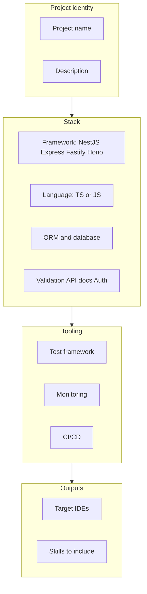

# Usage

## Two modes

| Mode | When to use |
|------|-------------|
| **Interactive** | First time, or a custom stack not covered by a preset |
| **`--preset`** | CI, docs, or a known stack (Nest + Prisma, etc.) |

## Interactive flow (grouped)

The CLI walks through **project identity → stack → tooling → outputs**. Roughly:



::: tip What you will be asked
- **Framework:** NestJS, Express, Fastify, Hono  
- **Language:** TypeScript or JavaScript  
- **ORM:** Prisma, TypeORM, Drizzle, MikroORM, Knex, or none (raw SQL)  
- **Database:** PostgreSQL, MySQL, MongoDB, SQLite  
- **Validation:** class-validator, Zod, Joi, or none  
- **API docs:** Swagger/OpenAPI or none  
- **Auth:** JWT (Passport), session, OAuth2 provider, custom, or none  
- **Tests:** Jest, Vitest, Mocha  
- **Monitoring:** Sentry, APM, Prometheus (multi-select)  
- **CI/CD:** GitHub Actions, GitLab CI, or none  
- **IDEs:** Cursor, Claude Code, VS Code Copilot, Antigravity, Windsurf, or all  
- **Skills:** plan-review, code-review, QA, ship, plus optional workflows (document-release, retro, db-migration-review, api-contract-check, dependency-audit) or all  
:::

If you omit `--output`, the CLI prompts for a directory (and warns if it is non-empty).

## Presets (non-interactive)

::: code-group

```bash [nestjs-prisma]
npx backend-ai-starter-recipes --preset nestjs-prisma --output ./my-nestjs-app
```

```bash [nestjs-typeorm]
npx backend-ai-starter-recipes --preset nestjs-typeorm --output ./my-app
```

```bash [express-prisma]
npx backend-ai-starter-recipes --preset express-prisma --output ./my-express-app
```

```bash [fastify-drizzle]
npx backend-ai-starter-recipes --preset fastify-drizzle --output ./my-fastify-app
```

:::

## CLI flags

| Flag | Short | Description |
|------|-------|-------------|
| `--output <dir>` | `-o` | Output directory (skips the path prompt) |
| `--preset <name>` | `-p` | Use a JSON preset from the package’s `presets/` folder |

## Minimal example

```bash
npx backend-ai-starter-recipes --preset nestjs-prisma --output ./api
```

You should see a tree similar to:

```text
api/
├── .ai/
│   ├── AGENT.md
│   ├── rules/
│   ├── skills/
│   ├── context/
│   └── tracking/
├── .cursor/          # if Cursor was selected in preset
└── ...
```

(Preset defaults include specific IDEs; customize via interactive run or by editing a copied preset JSON for your fork.)

---

**Next:** learn what each folder means — [Understanding the output](/guide/5-the-output).
