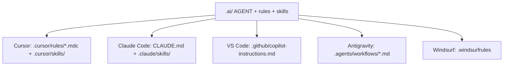

# Understanding the output

## Canonical tree: `.ai/`

Everything else is derived from here. Commit `.ai/` (and your chosen IDE files) like normal project config.
The CLI creates repo instructions and adapter files, not a runnable backend service. Treat the generated `.ai/` tree as a starting operating manual for your project and edit it after reviewing the output.

```text
.ai/
├── AGENT.md                 # Core agent identity + principles + quality gates
├── lifecycle/               # Think, Plan, Build, Review, Test, Ship, Reflect
├── rules/                   # Always-on standards (Markdown)
├── skills/<name>/           # Workflows (SKILL.md, sometimes checklist.md)
├── context/                 # You refine: domain map + approved tech stack
└── tracking/                # Optional metrics / iteration notes
```

`rules/data-layer.md` is omitted when you chose **no ORM**. Skills appear only for workflows you selected.

## Lifecycle

Lifecycle files live under `.ai/lifecycle/`:

| Stage | Purpose |
|-------|---------|
| `think.md` | Understand the backend goal, stack, contracts, data/auth risks, and constraints before planning |
| `plan.md` | Name affected APIs, data models, migrations, auth boundaries, integrations, jobs, risks, and tests |
| `build.md` | Implement only the approved backend scope |
| `review.md` | Check correctness, API compatibility, data integrity, security, observability, and adapter output |
| `test.md` | Run or define validation proportional to backend risk |
| `ship.md` | Summarize changes, validation, release notes, breaking changes, and rollback notes |
| `reflect.md` | Capture backend template gaps and follow-up tasks |

## Rules (what they steer)

| Rule file | What it controls |
|-----------|------------------|
| `architecture.md` | Module/router/plugin layout, DI, repository pattern, shutdown |
| `api-patterns.md` | Validation, OpenAPI, pagination, rate limits, CORS, versioning |
| `errors-logging-security.md` | Errors, logging, authz, observability hooks |
| `external-integrations.md` | Third-party clients, retries, mapping failures |
| `testing.md` | Unit vs e2e, framework idioms, mocking |
| `pre-commit.md` | Build / lint / test gates before commit |
| `async-patterns.md` | Queues, jobs, idempotency, cron |
| `environment.md` | Config, env files, Docker, flags |
| `git-conventions.md` | Branches, commits, PR focus |
| `data-layer.md` | ORM schema, migrations, repositories *(if ORM ≠ none)* |

## Skills (when to run them)

| Skill | Purpose | Typical moment |
|-------|---------|----------------|
| `plan-review` | Staff-level plan before code | After a written plan, before implementation |
| `code-review` | Diff review with checklist | Before merge / after a big change |
| `qa` | Build, tests, API health-style pass | Before calling a feature “done” |
| `ship` | Commit, push, open PR | When you are ready to land work |
| `document-release` | Refresh README / changelog from last change | After shipping |
| `retro` | Short productivity retro | End of week / sprint |
| `db-migration-review` | Safe migrations | Before merging schema changes |
| `api-contract-check` | Breaking API detection | When DTOs or routes change |
| `dependency-audit` | npm audit + necessity | Dependency bumps |

## Context and tracking

- **`context/domain-map.md`** — Fill in real domains, directories, and pitfalls for *your* product.  
- **`context/tech-stack.md`** — Table of approved libraries; keeps the agent from freelancing new deps.  
- **`tracking/efficiency.md`** — Space to log accept/reject patterns and tighten rules over time.

## IDE adapters



::: code-group

``` [Cursor]
.cursor/rules/index.mdc      # from AGENT.md
.cursor/rules/lifecycle.mdc  # from lifecycle/*.md
.cursor/rules/*.mdc          # from rules/*.md (globs where relevant)
.cursor/skills/<skill>/     # copied from .ai/skills/
```

``` [Claude Code]
CLAUDE.md                    # AGENT + lifecycle + rules merged
.claude/skills/<skill>/      # copied skills
```

``` [VS Code Copilot]
.github/copilot-instructions.md   # AGENT + lifecycle + rules merged
```

``` [Antigravity]
.agents/workflows/<skill>.md      # one workflow per skill
```

``` [Windsurf]
.windsurfrules               # AGENT + lifecycle + rules merged
```

:::

## Concrete example (NestJS + Prisma preset)

A typical output includes `.ai/` plus adapter folders from the preset’s IDE list, for example:

```text
my-nestjs-app/
├── .ai/
│   ├── AGENT.md
│   ├── lifecycle/
│   │   ├── think.md
│   │   ├── plan.md
│   │   └── …
│   ├── rules/
│   │   ├── architecture.md
│   │   ├── data-layer.md
│   │   └── …
│   ├── skills/plan-review/SKILL.md
│   ├── skills/code-review/SKILL.md
│   ├── skills/code-review/checklist.md
│   └── …
├── .cursor/rules/*.mdc
├── CLAUDE.md
└── .claude/skills/…
```

---

**Next:** put it together in a day-to-day loop — [Recommended workflow](/guide/6-workflow).
