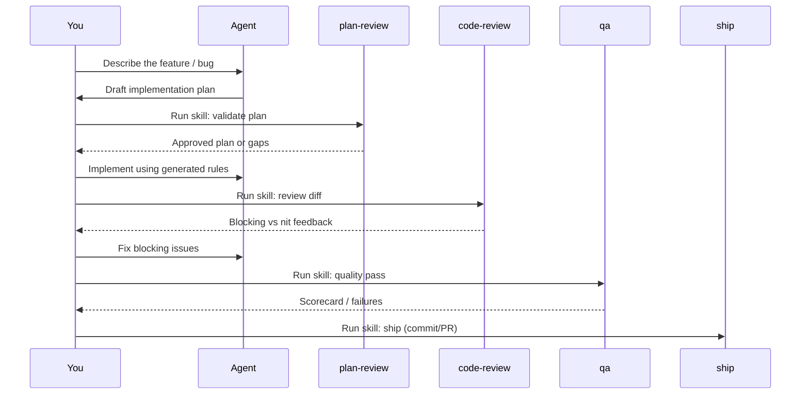

# Recommended workflow

This is the **story** most teams want: same quality bar every feature, without re-explaining the stack.

## The loop

## Step-by-step

### 1. Write requirements in plain language

No ceremony — what users need, constraints, and out-of-scope. The agent already knows your framework and ORM from `.ai/`.

### 2. Let the agent propose a plan

Ask for a plan that references your modules, data model, and API surface. You are aiming for **one coherent design**, not a stream of edits.

### 3. Run **plan-review** before coding

::: tip Invoke the skill
In **Cursor**, use the skill UI or ask explicitly: “Follow the plan-review skill in `.ai/skills/plan-review/`.”  
In **Claude Code**, open the skill from `.claude/skills/plan-review/`.  
Other IDEs: use the path your adapter created (see [Understanding the output](/guide/5-the-output)).
:::

Outcome: scope, architecture, data layer, API, and test strategy are sanity-checked **before** files multiply.

### 4. Implement

The agent should follow `.ai/rules/*` automatically — repository pattern, validation style, error handling, etc. If it drifts, point at the specific rule file.

### 5. Run **code-review** on the diff

Read-only review pass with a checklist (security, data layer, architecture, Git hygiene). Fix **blocking** items before asking for a human review.

### 6. Run **qa**

Builds, tests, and structured checks the skill describes — you get a clearer “done” signal than “looks fine in the editor.”

### 7. Run **ship**

Commit message conventions, push, and PR creation flow are encoded in the skill (often using `gh` where applicable).

::: details Bonus skills (when they shine)
- **document-release** — after merge, sync README/CHANGELOG/API docs.  
- **retro** — periodic look at churn and test health.  
- **db-migration-review** — before risky migrations.  
- **api-contract-check** — when response shapes or routes change.  
- **dependency-audit** — upgrades and new packages.  
:::

## After generation

1. **Edit** `.ai/context/domain-map.md` with real domains and folder notes.  
2. **Lock** `.ai/context/tech-stack.md` to libraries you actually allow.  
3. **Use** `.ai/tracking/efficiency.md` when the same mistake keeps recurring — that is a signal to patch a rule.

---

You are now at “mastery” for day-to-day use. To improve the **generator** itself or report issues, see [Contributing & support](/community/contributing).
