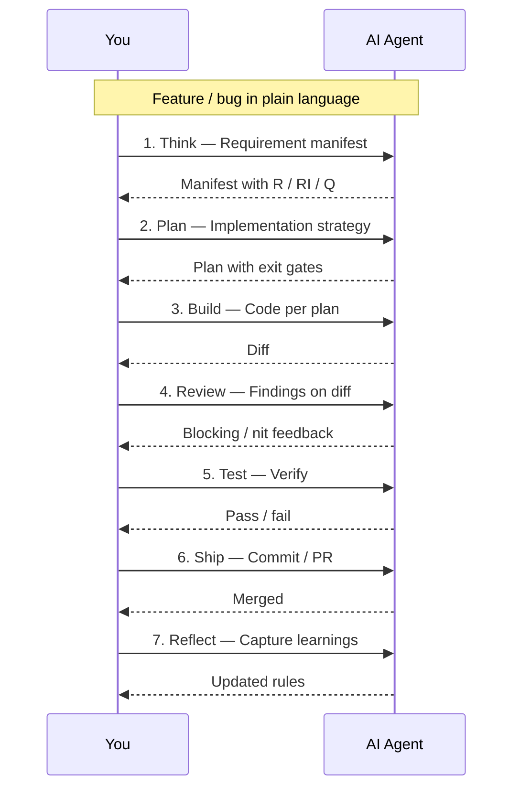

# Recommended workflow

Every feature lives inside the same repeatable loop. The seven lifecycle stages are encoded in the files Bare generated — your IDE loads them at startup; you invoke them by name.

## Step-by-step

### 1. Think — clarify requirements before writing a single route

Invoke the **Think** skill and paste your prompt, ticket, or feature description. The agent will ask clarifying questions and produce a **Requirement Manifest** — a numbered list of explicit requirements (R), implicit constraints (RI), assumptions (A), and open questions (Q).

::: tip Invoke
In **Cursor**: type `/think` in Agent chat.  
In **Claude Code**: run `/think` from the command palette.  
In **VS Code Copilot**: reference the `Think` section in `copilot-instructions.md`.  
In **Windsurf**: open `.windsurf/rules/lifecycle-think.md`.  
In **Antigravity**: open `.agents/workflows/think.md`.
:::

**Iterate here.** Surface every ambiguity — API contract, auth scope, data ownership, migration safety, idempotency guarantees, and error semantics. The agent knows your framework and ORM from the generated rules, so the manifest can reference your actual table names and service boundaries. A tight manifest is the contract the plan and build phases reference strictly.

---

### 2. Plan — turn requirements into an actionable implementation strategy

Invoke the **Plan** skill and hand it the manifest from Think. The agent produces a structured plan covering: endpoint signatures and HTTP semantics, ORM queries and migration steps, auth and authorisation guards, error response shapes, integration with async queues or external services, and an acceptance gate per requirement.

::: tip Invoke
In **Cursor**: type `/plan` in Agent chat.  
In **Claude Code**: run `/plan`.  
In other adapters, use the equivalent path your adapter created (see [Understanding the output](./5-the-output.md)).
:::

**Review the plan before agreeing.** Verify that every R-ID from the manifest appears in the plan, that the approach fits your architecture rule (`architecture-api`), that migration steps are safe under concurrent traffic, and that nothing was silently deferred. Approve explicitly — the build phase treats the approved plan as ground truth and will not deviate from it.

---

### 3. Build — implement strictly against the approved plan

Invoke the **Build** skill. The agent reads your approved plan and follows your generated rules — API architecture, auth and security, errors and observability, integrations and async patterns, testing conventions, pre-commit hooks, environment handling, and git conventions — then writes the code.

::: tip Invoke
In **Cursor**: type `/build` in Agent chat.  
In **Claude Code**: run `/build`.  
In other adapters, use the equivalent path your adapter created.
:::

**Scope discipline.** If a new requirement surfaces mid-build, stop. Add it to the manifest, update the plan, then resume. Build closes when every R-ID has a corresponding code change, migrations are staged, and the local test suite passes. Backend changes that touch the data layer require a passing migration dry-run before this phase can close.

---

### 4. Review — audit the diff against your quality gates

Invoke the **Review** skill against the diff. The agent runs a structured checklist drawn from your rules: API contract correctness (status codes, error shapes, pagination), ORM query safety (N+1, missing indexes, unbounded scans), auth guards on every protected route, input validation and sanitisation at the boundary, secrets handling (no credentials in logs or responses), error propagation to observability, and git conventions.

::: tip Invoke
In **Cursor**: type `/review` in Agent chat.  
In **Claude Code**: run `/review`.
:::

Fix every **blocking** finding before moving forward. Security and data-safety findings are always blocking regardless of perceived risk. Nit-level items should be captured in a follow-up ticket. A clean review pass is the gate to Test.

---

### 5. Test — verify with unit, integration, and manual checks

Invoke the **Test** skill. The agent will:

- Write or update **unit tests** for service logic, validators, and utility functions.
- Add **integration tests** for changed routes — covering the happy path, auth rejection, validation failure, and at least one data-layer edge case from the manifest.
- Verify that coverage thresholds configured in your project are met.
- Produce a **manual verification checklist**: run the migration against a local copy of the schema, smoke-test the affected endpoints with real payloads, verify error responses are structured correctly, and confirm no unintended data is exposed.

::: tip Invoke
In **Cursor**: type `/test` in Agent chat.  
In **Claude Code**: run `/test`.
:::

**Integration tests are not optional for data-layer changes.** Mocked tests pass when the real migration fails. Run the suite against a real database before calling this phase done.

---

### 6. Ship — create the PR, update docs, prepare the release

Invoke the **Ship** skill. The agent will:

- Draft a commit message following your `git-conventions` rule.
- Open a pull request (via `gh` where available) with a structured description — intent, major changes, migration notes, evidence, and review notes.
- Check for changelog, API documentation, or OpenAPI spec entries that need updating.
- Flag any release-tag, version bump, or deployment steps your project requires (including migration execution order if the schema change is destructive).

::: tip Invoke
In **Cursor**: type `/ship` in Agent chat.  
In **Claude Code**: run `/ship`.
:::

Ship means the PR is open and reviewable — not that it is merged. CI runs here. Do not approve until CI is green, migration tests pass in the pipeline, and at least one human has read the review notes.

---

### 7. Reflect — close the loop and sharpen your rules permanently

Invoke the **Reflect** skill after the PR merges, or after any session where the agent drifted from your conventions — wrote raw SQL instead of using your ORM, bypassed your auth middleware, or generated the wrong error shape. The agent will ask you to cite the mistakes and produce a **learning document** saved alongside your rules.

::: tip Invoke
In **Cursor**: type `/reflect` in Agent chat.  
In **Claude Code**: run `/reflect`.
:::

**Reflect is the compounding step.** Each learning entry makes your generated rules sharper for every future session. If the agent generated an unbounded query twice, Reflect is where you encode "always add `.take()` or `LIMIT`" into the `architecture-api` rule permanently — not just correct it in chat. Over time this is what turns a generic agent into one that understands your data model and safety requirements.

---

## After generation

1. Open the **agent file** your IDE generated (`CLAUDE.md`, `.cursor/rules/index.mdc`, `.github/copilot-instructions.md`, etc.) and fill in your real domain names, service boundaries, and project-specific constraints.
2. Review the generated **rules** for your stack — edit any rule that doesn't match your team's actual conventions before your first session.
3. Use Reflect proactively. Every time the agent repeats a mistake or drifts from your conventions, that is a signal to sharpen the corresponding rule file — one edit, fixed for every future session.

---

You are now at "mastery" for day-to-day use. To improve the **generator** itself or report issues, see [Contributing & support](/community/contributing).
